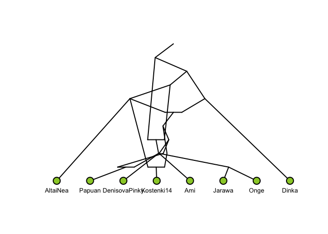

<!-- README.md is generated from README.Rmd. Please edit that file -->

# graphparse

## Installation

``` r
# install.packages("devtools")
devtools::install_github("mailund/graphparse")
```

## Example

``` r
test_graph <- readr::read_file("data-raw/Basic_OngeEA_wArch.graph")
g <- graphparse::read_qpgraph(test_graph)
plot(g)
#> fminbnd:  Exiting: Maximum number of function evaluations has been exceeded
#>          - increase MaxFunEvals option.
#>          Current function value: 4415.55067105093
```


