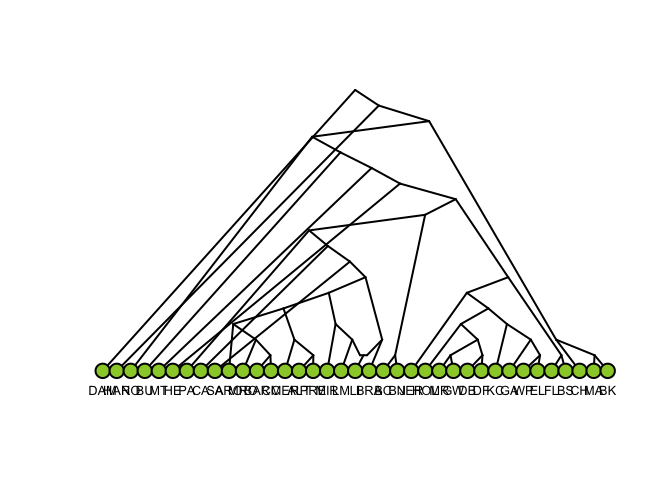

<!-- README.md is generated from README.Rmd. Please edit that file -->

# graphparse

## Installation

``` r
# install.packages("devtools")
devtools::install_github("mailund/graphparse")
```

## Example

Parsing a qpGraph file:

``` r
test_graph <- readr::read_file("data-raw/Basic_OngeEA_wArch.graph")
g <- graphparse::read_qpgraph(test_graph)
plot(g)
#> fminbnd:  Exiting: No possible improvement of cost function.
```


``` r
attr(g, "admixture_proportions")
#>                     K2_K                     P2_P     AdmixedNonAfr_AfrAnc 
#>                      0.5                      0.5                      0.5 
#> DenisovaAncAnc_SuperArch 
#>                      0.5
```

Parsing a dot file:

``` r
test_graph <- readr::read_file("data-raw/Basic_OngeEA_wArch.dot")
g <- graphparse::read_dot(test_graph)
#> # A tibble: 2 x 3
#>   from        to    label    
#>   <chr>       <chr> <chr>    
#> 1 DenisovaAnc P2    "\"3%\"" 
#> 2 P           P2    "\"97%\""
#> # A tibble: 2 x 3
#>   from   to    label    
#>   <chr>  <chr> <chr>    
#> 1 NeaAnc K2    "\"1%\"" 
#> 2 K      K2    "\"99%\""
#> # A tibble: 2 x 3
#>   from   to            label    
#>   <chr>  <chr>         <chr>    
#> 1 NeaAnc AdmixedNonAfr "\"3%\"" 
#> 2 AfrAnc AdmixedNonAfr "\"97%\""
#> # A tibble: 2 x 3
#>   from      to             label    
#>   <chr>     <chr>          <chr>    
#> 1 Arch      DenisovaAncAnc "\"49%\""
#> 2 SuperArch DenisovaAncAnc "\"51%\""
plot(g)
#> fminbnd:  Exiting: Maximum number of function evaluations has been exceeded
#>          - increase MaxFunEvals option.
#>          Current function value: 9400.95285288696
```


``` r
attr(g, "admixture_proportions")
#>  Arch_DenisovaAncAnc NeaAnc_AdmixedNonAfr            NeaAnc_K2 
#>                 0.49                 0.03                 0.01 
#>       DenisovaAnc_P2 
#>                 0.03
```

``` r
test_graph <- readr::read_file("data-raw/test1.graph")
g <- graphparse::read_qpgraph(test_graph)
plot(g)
```


``` r
attr(g, "admixture_proportions")
#> numeric(0)
```

``` r
test_graph <- readr::read_file("data-raw/BosGraph.dot")
g <- graphparse::read_dot(test_graph)
#> # A tibble: 2 x 3
#>   from  to    label    
#>   <chr> <chr> <chr>    
#> 1 H2    E2    "\"15%\""
#> 2 D2    E2    "\"85%\""
plot(g)
#> fminbnd:  Exiting: Maximum number of function evaluations has been exceeded
#>          - increase MaxFunEvals option.
#>          Current function value: 7034.41173643302
```


